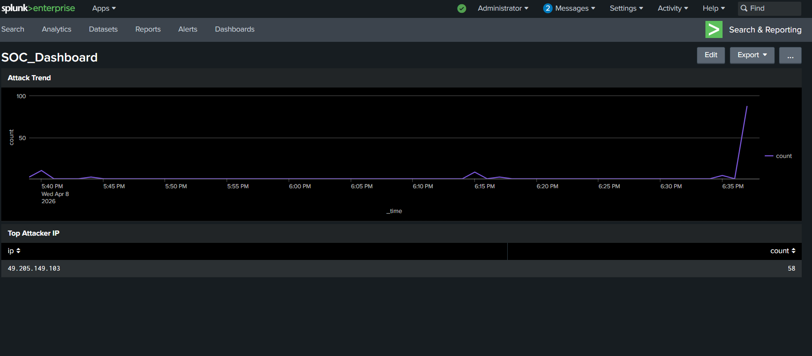

# 🔐 Cloud-Based SOC Lab using AWS & Splunk

## 📌 Overview
This project demonstrates a Security Operations Center (SOC) lab built on AWS to detect brute-force SSH attacks using Splunk SIEM.

## ⚙️ Tech Stack
- AWS EC2 (Ubuntu)
- Splunk Enterprise
- Linux Authentication Logs (/var/log/auth.log)

## 🚀 Features
- Log ingestion from Linux server
- Detection of failed SSH login attempts
- Extraction of attacker IP addresses using regex
- Real-time alerting using Splunk
- Dashboard visualization of attack trends

## 🏗️ Architecture
Attacker (Local Machine) → AWS EC2 → auth.log → Splunk → Detection → Dashboard

## 🔍 Detection Logic
- Monitor `/var/log/auth.log`
- Identify:
  - Failed password attempts
  - Invalid user attempts
- Extract IP:
  - Using regex
- Count attempts per IP

## 📊 Dashboard Panels
- Attack Trend (time-based visualization)
- Top Attacker IPs

## 🧪 Attack Simulation
Simulated brute-force attack using multiple failed SSH login attempts.

## 🎯 Outcome
Successfully built a working SOC environment capable of detecting and visualizing cyber attacks in real-time.

## 💡 Key Learnings
- SIEM implementation (Splunk)
- Log analysis and monitoring
- Attack detection techniques
- Cloud security basics (AWS)
- Troubleshooting real-world issues (disk, ingestion, performance)

## 📸 Screenshots

### Dashboard

